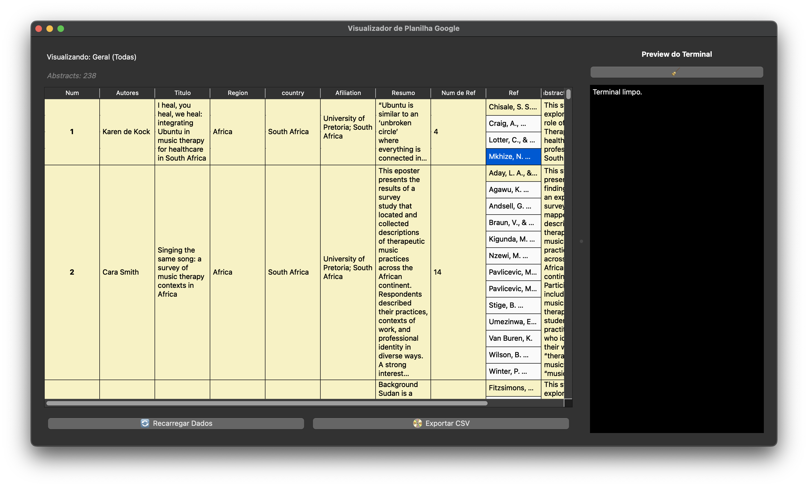

# Visualizador de Planilha Google com PyQt5

Este projeto é um visualizador de planilhas do Google Sheets exportadas em CSV, desenvolvido em Python usando PyQt5 e pandas. A interface gráfica permite filtrar dados por região e autor, visualizar detalhes das linhas no console interno e exportar os dados filtrados para CSV.

---

## Funcionalidades

- Carregamento automático dos dados a partir de uma planilha Google Sheets (CSV).
- Filtro por região e autores via menu.
- Visualização da tabela com coloração por região.
- Console embutido para exibir detalhes da linha selecionada e mensagens do sistema.
- Exportação dos dados filtrados para arquivo CSV.
- Botão para recarregar os dados.

---


## Captura de Tela

Abaixo está uma visualização da interface do aplicativo:



---

## Requisitos

- Python 3.x
- PyQt5
- pandas

---

## Instalação das dependências

```bash
pip install pandas pyqt5
